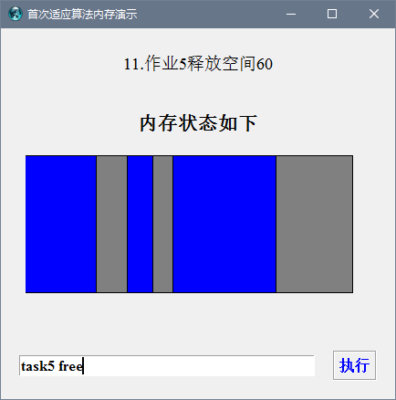

# 操作系统实验及课设（Ruby语言的实现）

## 概览
四个实验分别在exp1~exp4中，课设在tk下。

1. 实验1  使用动态优先权的进程调度算法的模拟
2. 实验2  使用动态分区分配方式的模拟
3. 实验3  请求调页存储管理方式的模拟
4. 实验4  磁盘文件操作
5. 课设 使用ruby的图形化界面实现了对首次适应算法

*注:实验1到实验4具体的要求见[OS实验报告-jsj.doc](./OS实验报告-jsj.doc)*

## 课程设计

### 具体要求
在Windows /Linux环境下实现，建立一张类似课本122页（第三版）的分区使用表，并提供一组模拟作业，根据作业使用内存情况，参考课本125页（第三版）分配流程，采用首次适应算法，为其在分区使用表中分配内存。程序要能够在图形界面下形象显示作业，及表中信息。

### ruby图形化环境设置
 1. win用户需要下载并安装[ActiveState's ActiveTcl](http://www.activestate.com/activetcl/downloads)
 2. 打开控制台,输入 `gem install -r tk` ,下载ruby的tk库
 3. 运行以下代码进行测试:

```ruby
require 'tk'

root = TkRoot.new { title "Hello, World!" }
TkLabel.new(root) do
   text 'Hello, World!'
   pack { padx 15 ; pady 15; side 'left' }
end
Tk.mainloop
```

### 实现
根据用户输入的指令（格式写为正则表达式是`task[0-9] (alloc|free)`，例如`task0 alloc`） 执行指定作业的内存分配与释放，利用`TkCanvas`上的`TkcRectangle`的改变来模拟，在控制台输出各内存块的详细信息。

运行效果如下：



## 感受
很早之前就听说了Ruby风靡硅谷，却一直没有接触。直到了去年的不经意间在图书馆看到了[《超越Java》](https://book.douban.com/subject/2043934/)一书。这本书主要讲了Java的一些不足，并力推Ruby为Java语言的继承者。从那时起，我渐渐对Ruby有了兴趣。

一个月前时间才怀着玩一玩的心态接触了Ruby，最初借助[Ruby 教程 | 菜鸟教程](http://www.runoob.com/ruby/ruby-tutorial.html)快速入门，后来大致看了一下Ruby自带的文档进行学习。

后来又看了Ruby作者Matz大师所著的[《松本行弘的程序世界》](https://book.douban.com/subject/6756090/)一书。书中推崇的“一切皆因兴趣”和开源精神让我感触良多。

对于我这个Java程序员，Ruby简短而炫丽的书写无疑是富有魅力的，另外Ruby的元编程也展示其极高的灵活性，函数式编程也极大地缩短了代码量。正是因此，我选用Ruby完成了操作实验四次实验。

不可否认的是Ruby过于灵活，很难掌握其精髓，真不愧为一门“黑客语言”啊！在我编程的时候，多次为其灵活的语法困扰，但也一路查文档、查书、问度娘挺过来了，回头再想想那段经历确实是十分的过瘾。

没想到过了没多久，操作系统的课设就来了，分到的题目正好和实验三的相似，于是乎就开始了对Ruby图形化界面的研究，主要在[易佰RubyTK教程](http://www.yiibai.com/ruby/ruby_tk_guide.html)这里学习tk的使用，另外也上网查了一些tcl的资料，才使得程序最终完成。用RubyTk写图形化界面，一如Ruby的风格，简短而难以掌握。

总之，人生苦短，why not ruby？
